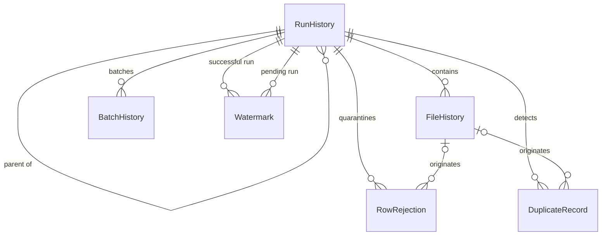

# ETL control framework

This directory contains a reusable Microsoft SQL Server ETL control framework. It supports SQL Server 2016 and later and does not create or modify application data tables.

## Execution order

Run the scripts in numeric order against the intended control database:

1. `001_Create_ETL_Schema.sql`
2. `002_Create_ETL_RunHistory.sql`
3. `003_Create_ETL_FileHistory.sql`
4. `004_Create_ETL_RowRejection.sql`
5. `005_Create_ETL_DuplicateRecord.sql`
6. `006_Create_ETL_Watermark.sql`
7. `007_Create_ETL_BatchHistory.sql`
8. `008_Create_ETL_Indexes.sql`
9. `009_Create_ETL_Views.sql`
10. `010_Create_ETL_StoredProcedures.sql`
11. `011_Create_ETL_SeedData.sql`
12. `012_ETL_Framework_Validation.sql`

Select the database in the client or uncomment and replace the optional `USE [YourDatabaseName]` line. The validation script creates test records inside a transaction and rolls them all back.

## Data dictionary

| Table | Purpose | Key data |
|---|---|---|
| `ETL.RunHistory` | One record per ETL execution, including source/target identity, lifecycle status, row reconciliation totals, output paths, and errors. | `ETLRunID` is the generated primary key. `ParentETLRunID` models orchestration hierarchies. |
| `ETL.FileHistory` | One record per registered source-file attempt, including file identity, SHA-256 hash, structure metadata, processing times, and outcome. | `ETLFileID` is the generated primary key; `ETLRunID` identifies the owning run. |
| `ETL.RowRejection` | Central quarantine for row-level and cell-level validation failures, preserving the source locator, invalid value, rule context, and full JSON record. | `RejectionID` is the generated primary key. `ETLFileID` is optional for non-file sources. `ReprocessedETLRunID` records recovery lineage. |
| `ETL.DuplicateRecord` | Records exact, conflicting, source, and target duplicates and the chosen resolution. | `DuplicateID` is the generated primary key. Business keys are readable; optional SHA-256 hashes support efficient matching. |
| `ETL.Watermark` | Stores the last committed incremental boundary and a separately owned pending boundary. | `WatermarkID` is the generated primary key. Job, source system, and source object form a unique business key. |
| `ETL.BatchHistory` | Records per-batch row totals, timing, status, and errors for large or chunked loads. | `ETLBatchID` is the generated primary key. Run and batch number are unique together. |

All generated identifiers use `BIGINT IDENTITY(1,1)`. Audit timestamps use `DATETIME2(0)` and UTC defaults. Status/type domains are enforced by named check constraints; `ErrorCode` remains extensible.

## Relationships

## Shared use by CSV and Snowflake jobs

Both source types open `RunHistory`, progress through the same statuses, report the same reconciliation counts, and use the same completion procedure. CSV jobs additionally register each physical file in `FileHistory` and use `ETLFileID` on rejection and duplicate rows. Snowflake jobs normally leave `ETLFileID` and `SourceRowNumber` null, identify the query/table in `SourceObject`, and populate `SourceRecordID` with a primary key, compound key, or extraction identifier.

Both can write complete source records to the JSON columns, use `DuplicateRecord` for source/target matching outcomes, and use the two-step `Watermark` workflow for incremental loads. A pending upper bound is captured before extraction; it is promoted only after the target load completes successfully.

## Assumptions and design decisions

- Framework objects are installed in the same database and schema, `ETL`; target application tables may be in any recorded database/schema/table.
- All operational timestamps are UTC. Source file timestamps are stored as supplied and should be normalized by the caller.
- File hashes are 64-character hexadecimal SHA-256 values. `usp_RegisterFile` uses range locking to prevent concurrent active registrations and treats prior active, loaded, or archived files as duplicates while allowing failed and rejected attempts to be retried.
- Stored procedures are the supported write interface for concurrency-sensitive file registration and watermark changes. `MERGE` and dynamic SQL are not used.
- Completion reconciliation is `RowsReceived = RowsInvalid + RowsExactDuplicate + RowsConflictingDuplicate + RowsInserted + RowsUpdated + RowsUnchanged + RowsSkipped`. Callers with load-specific accounting can set the optional `@ValidateReconciliation = 0`, but should document and surface the difference rather than silently ignoring it.
- `RowsAlreadyExist` and `RowsRejected` are operational measures and may overlap categorized reconciliation counts, so they are not added again to the formula.
- No lookup tables are used because these status/type domains are small and stable. Suggested error codes are documented in script 011, but error codes are not constrained so new rules can be introduced without DDL changes.
